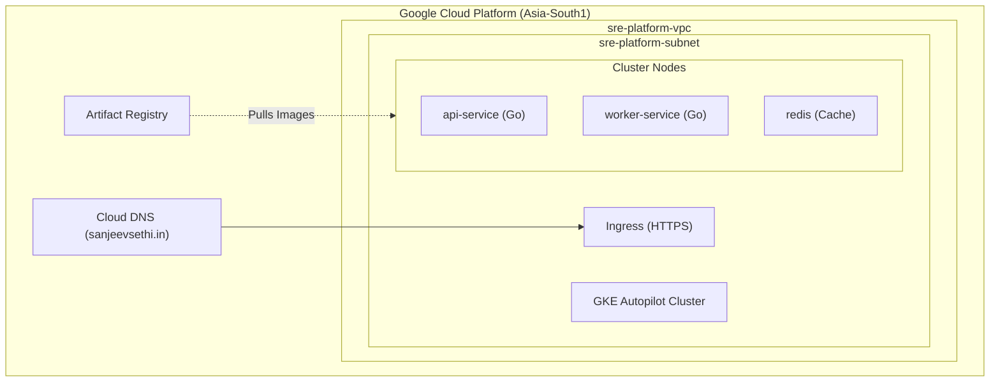
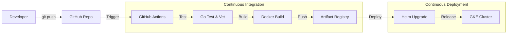

# Platform Architecture

The SRE Portfolio platform runs on a production-grade Kubernetes cluster provisioned via Terraform on Google Cloud Platform. This page details the infrastructure, deployment pipeline, and observability stack.

## 1. Cloud Infrastructure (GKE)

The foundation is a **GKE Autopilot** cluster running in a custom VPC. All infrastructure is managed as code (IaC) using Terraform.

### Architecture Diagram

### Key Decisions
* **GKE Autopilot**: Selected for zero-overhead node management and built-in security best practices.
* **Terraform State**: Stored remotely in GCS buckets for team collaboration and lock safety.
* **Network**: Complete VPC isolation with minimal public exposure.

---

## 2. CI/CD Pipeline

We follow GitOps principles where possible. Deployment is automated via GitHub Actions.

### Pipeline Steps
1. **Test**: Runs `go test ./...` and `go vet` to ensure code quality.
2. **Build**: Builds multi-stage Docker images (optimized using distroless base).
3. **Publish**: Pushes tagged images to Google Artifact Registry.
4. **Deploy**: Uses Helm to upgrade the application on GKE, ensuring zero-downtime rolling updates.

---

## 3. Observability Stack

The platform implements the three pillars of observability:

* **Metrics**: Prometheus (Google Managed) scrapes endpoints. Grafana visualizes Golden Signals (Latency, Traffic, Errors, Saturation).
* **Logs**: Structured JSON logging (Zerolog) with correlation IDs.
* **Traces**: OpenTelemetry (OTel) instrumentation for end-to-end request tracing.
