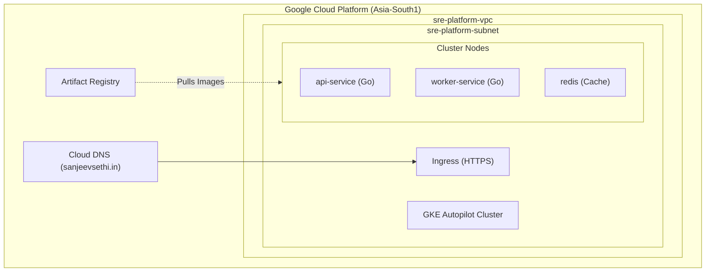
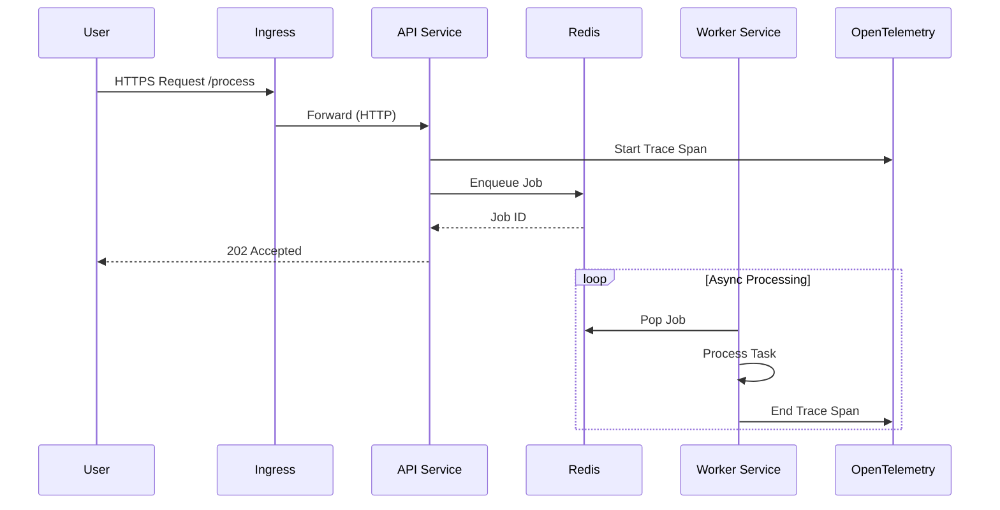
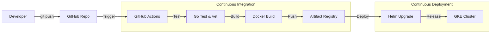

# SRE Platform Architecture

The SRE Portfolio platform runs on a **production-grade Kubernetes cluster** provisioned via Terraform on Google Cloud Platform (GCP). This page details the infrastructure design, request lifecycle, deployment pipeline, and security hardening measures.

---

## 1. Cloud Infrastructure (GKE)

The foundation is [GKE Autopilot](https://cloud.google.com/kubernetes-engine/docs/concepts/autopilot-overview), chosen for its secure-by-default configuration and managed operational overhead.

### Infrastructure Diagram

### Key Technical Decisions
*   **IaC (Infrastructure as Code)**: All resources (VPC, DNS, GKE) are defined in **Terraform**, ensuring reproducibility and preventing configuration drift.
*   **GKE Autopilot**: Automatically manages node provisioning and scaling, allowing focus on application SLOs rather than cluster upgrades.
*   **Network Isolation**: Custom VPC with private subnets. No default networks are used.

---

## 2. Request Lifecycle & Observability

How a user request travels through the system and is observed.

### Observability Stack
*   **Metrics**: Google Managed Prometheus scrapes application metrics (latency, error rates).
*   **Visualization**: **Grafana** dashboards display Golden Signals (Saturation, Traffic, Errors, Latency).
*   **Tracing**: **OpenTelemetry** correlates requests across microservices. Every log line includes `trace_id`.

---

## 3. Security & Hardening

Security is "baked in" from the start, not added as an afterthought.

### 🛡️ Kubernetes Security
*   **Network Policies**: A "Default Deny" policy blocks all unauthorized traffic. Specific policies allow the API to talk to Redis and Worker to talk to DNS.
*   **Least Privilege**: Containers run as **non-root users** (UID 1000) with dropped Linux capabilities (`ALL` dropped).
*   **Read-Only Filesystems**: Attackers cannot modify application code at runtime.

### 🔒 CI/CD Security
*   **Distroless Images**: Docker images use `gcr.io/distroless/static`, containing only the binary and no OS shell, reducing the attack surface.
*   **Signed Commits**: All deployment triggers are verified via Git SHA.

---

## 4. CI/CD Pipeline

We follow **GitOps** principles. Changes are deployed automatically via GitHub Actions.

### Automation Steps
1.  **Test**: Runs `go test ./...` and `go vet` to ensure strict Go standards.
2.  **Build**: Multi-stage Docker builds produce tiny, secure binaries.
3.  **Publish**: Images pushed to Artifact Registry with immutable tags (Git SHA).
4.  **Deploy**: Helm upgrades the release with zero-downtime rolling updates.
